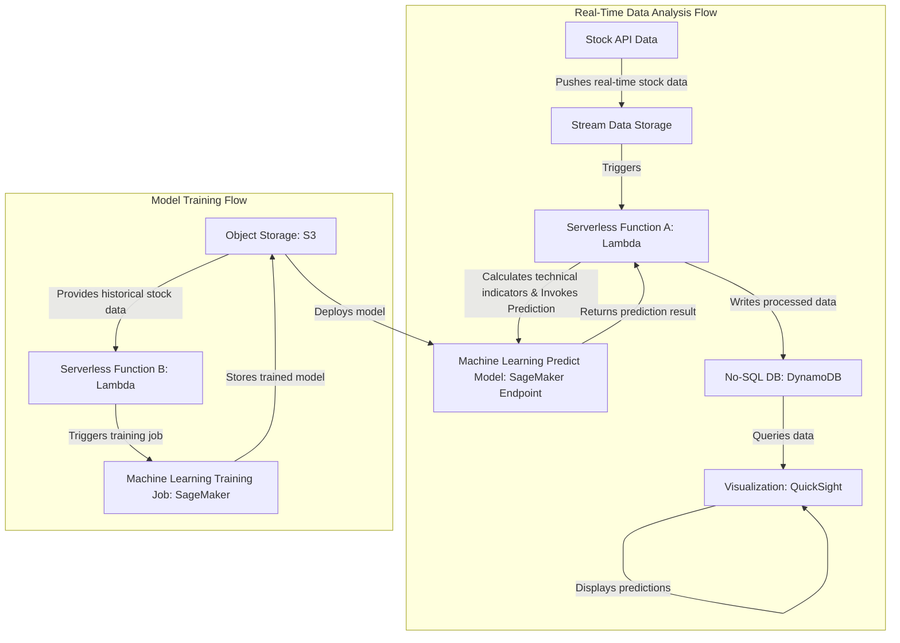

# Stock Analysis System

## 1. Project Overview
### 1.1 Original Goal
Build a real-time data processing pipeline using AWS Kinesis, DynamoDB, and Python to ingest, process, and store real-time data streams.

### 1.2 Refined Goal
To build an intelligent stock analysis system that leverages real-time and historical data to provide accurate stock price predictions, assisting investors in making informed decisions. The system automates data processing and analysis, utilizes advanced machine learning models for predictions, and ensures efficient storage and access to the results.

**Project Value Proposition:** Empower investors with more accurate investment decisions, reduce risk, and enhance investment returns.

## 2. System Architecture
### 2.1 Data Flow Architecture


### 2.2 Infrastructure Components
#### 2.2.1 Network Infrastructure
- VPC with public and private subnets
- NAT Gateway for private subnet internet access
- Security Groups for ECS tasks

#### 2.2.2 Core Services
- Amazon ECS Cluster (Fargate)
- Kinesis Data Stream
- Lambda Functions
- DynamoDB Table
- S3 Bucket
- SageMaker Endpoint
- IAM Roles and Policies

## 3. Development Phases
### 3.1 Phase 1: Core Functionality Validation
- Single stock analysis (TSLA)
- End-to-end data flow validation
- Basic visualization with QuickSight

### 3.2 Phase 2: Multi-Stock Support
- Multi-stock data processing
- Real-time price alerts via SNS
- Scheduled model training (3-day intervals)

### 3.3 Phase 3: System Enhancement
- Model training portal
- Performance optimization
- Enhanced visualization

## 4. Setup and Deployment
### 4.1 Prerequisites
- AWS Account
- Terraform >= 1.0
- AWS CLI configured
- Docker
- Python 3.9+

### 4.2 Repository Structure
```
.
├── README.md
├── network/
│   ├── config.tf
│   ├── main.tf
│   ├── outputs.tf
│   └── variables.tf
├── services/
│   ├── config.tf
│   ├── main.tf
│   ├── outputs.tf
│   └── variables.tf
├── lambda_function.zip
└── ta_lib_layer.zip
```

### 4.3 Deployment Steps
1. Network Infrastructure:
```bash
cd network
terraform init
terraform plan
terraform apply
```

2. Services Deployment:
```bash
cd ../services
terraform init
terraform plan
terraform apply
```

3. Post-Deployment Configuration:
   - Configure Docker image for data collection
   - Upload historical data to S3
   - Deploy SageMaker model
   - Set up QuickSight dashboard

## 5. Monitoring and Operations
### 5.1 CloudWatch Monitoring
- ECS container logs
- Lambda function logs
- Performance metrics
- Custom alerts

### 5.2 Security Measures
- Private subnet deployment
- Least privilege IAM roles
- KMS encryption
- Security group controls

### 5.3 Cost Optimization
- Fargate Spot usage
- DynamoDB on-demand capacity
- Optimized Lambda configuration
- Log retention management

## 6. Support and Maintenance
### 6.1 Cleanup
```bash
cd services
terraform destroy
cd ../network
terraform destroy
```

### 6.2 Contributing
1. Fork repository
2. Create feature branch
3. Submit pull request

## License
MIT License

## Contact
For support or inquiries, please contact:
- Email: [Your Email]